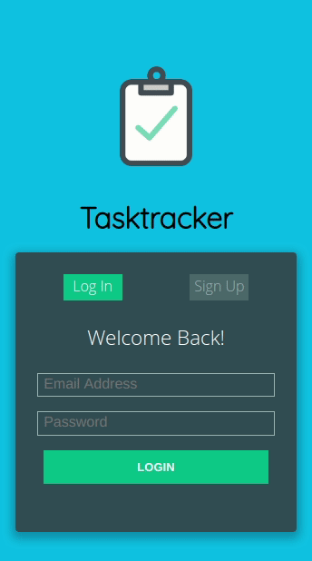

# Task-Track-App

<p align="center">
  
</p>

> Microverse Final Capstone Project

<p align="center">
  <br>
   <a href="https://github.com/ricardovaltierra/task-track-app" target="_blank"><strong>Explore the repo »</strong></a>
  <br>
    <a href="https://github.com/ricardovaltierra/task-track-app/issues" target="_blank">Request Feature</a>
  </p>
  <h2 align="center"><a href="https://steptracking.netlify.app/" target="_blank"><strong>Live version</strong></a></h2>


## Table of Contents

* [About the Project](#about-the-project)

* [Preview](#preview)

* [Built With](#built-with)

* [Getting Started](#getting-started)

* [How it Works](#how-it-works)

* [Contributing](#contributing)

* [Contact](#contact)

* [MIT License](#mit-license)

* [Creative Commons License](#creative-commons-license)

## About The Project

Mobile task app designed to register your todos and keep a record of every improvement you have daily. Register and create tasks as you want to keep track of, later make new records of improvement over them. View your finished ones and reset if you want to begin again from zero.

## Preview



### Built With

* [React](https://reactjs.org/)

* [Redux](https://redux.js.org/)

* [ES6](https://es6.io/)

* [SASS](https://sass-lang.com/)

* [Redux-thunk & Router](https://webpack.js.org/)

* npm Packages used:
    * [ESLint](https://eslint.org/)
    * [StyleLint](https://stylelint.io/)
    * [Babel](https://babeljs.io/)
    * [React Testing Library](https://testing-library.com/docs/react-testing-library/intro)

## Getting Started

To get a local copy up and running follow these simple steps.

Clone or fork the <a href="https://github.com/ricardovaltierra/task-track-app" target="_blank">repo</a> [git@github.com:ricardovaltierra/task-track-app.git].

*note you need have install npm or yarn.
* [npm](https://www.npmjs.com/get-npm)
* [yarn](https://classic.yarnpkg.com/en/docs/install)

## How it Works

This webpage is built on React & Redux basis with ES6, SASS and some other dependencies. All of the resources (images and gifs) are located inside `src/styles/assets` folder.

This project was bootstrapped with [Create React App](https://github.com/facebook/create-react-app).

### Running the code

*   Navigate to the root directory of the project.

*   Run this command on your terminal to add all the required packages and dependencies.
    ```
    $ npm install
    ```
*   Once that build with.
    ```
    $ npm run build
    ```
*   Now the app is ready, you can just open the generated index file on your server.
    ```
    $ npm start
    ```
*   If you're onto make some code edition you can 'watch' the live changes as follows.
    ```
    $ npm run watch
    ```
*   Curious about testing? Run it for the main reducer and actions (with a small `navbar` component test)
    ```
    $ npm test (filename.test.js)?
    ```      
   
## Contributing

Contributions are what make the open source community such an amazing place to learn, inspire, and create. Any contributions you make are **greatly appreciated**.

1. Fork the Project.

2. Create your Feature Branch (`git checkout -b feature/AmazingFeature`).

3. Commit your changes (`git commit -m 'Add some AmazingFeature'`).

4. Push to the Branch (`git push origin feature/AmazingFeature`).

5. Open a Pull Request.

## Contact

Ricardo Valtierra - [@RicardoValtie15](https://twitter.com/RicardoValtie15) - ricardo_valtierra@outlook.com  - [linkedin.com/in/ricardovaltierra/](https://www.linkedin.com/in/ricardovaltierra/)

## MIT License

This project is under the [MIT](LICENSE) license.

## Creative Commons License

Shield: [![CC BY-SA 4.0][cc-by-sa-shield]][cc-by-sa]

"Bodytrack.it" by [Gregoire Vella](https://www.behance.net/gregoirevella) is licensed under a [Creative Commons Attribution-ShareAlike 4.0
International License][cc-by-sa].

[![CC BY-SA 4.0][cc-by-sa-image]][cc-by-sa]

[cc-by-sa]: http://creativecommons.org/licenses/by-sa/4.0/
[cc-by-sa-image]: https://licensebuttons.net/l/by-sa/4.0/88x31.png
[cc-by-sa-shield]: https://img.shields.io/badge/License-CC%20BY--SA%204.0-lightgrey.svg

# 

Shield: [![CC BY-SA 4.0][cc-by-sa-shield]][cc-by-sa]

"Sign-Up/Login Form" by [Eric](https://codepen.io/ehermanson) is licensed under a [Creative Commons Attribution-ShareAlike 4.0
International License][cc-by-sa].

[![CC BY-SA 4.0][cc-by-sa-image]][cc-by-sa]

[cc-by-sa]: http://creativecommons.org/licenses/by-sa/4.0/
[cc-by-sa-image]: https://licensebuttons.net/l/by-sa/4.0/88x31.png
[cc-by-sa-shield]: https://img.shields.io/badge/License-CC%20BY--SA%204.0-lightgrey.svg
